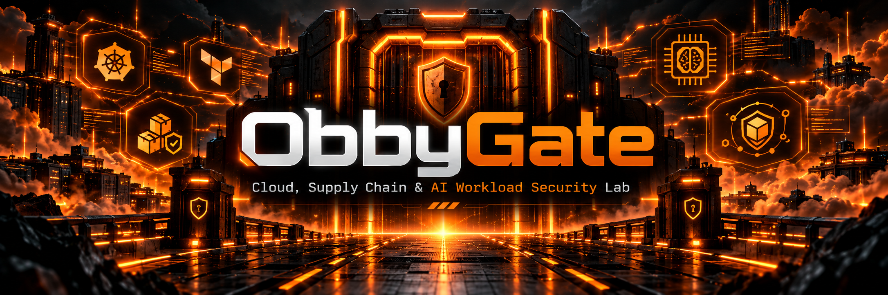

# ObbyGate



ObbyGate is a hands-on DevSecOps security lab built to demonstrate cloud-native deployment, infrastructure as code, container hardening, software supply-chain security, observability, and secured AI workload concepts.

The project is designed as both a portfolio project and a break/fix environment for practicing real-world DevOps and DevSecOps troubleshooting.

## Architecture

```text
Developer
    |
    v
GitHub
    |
    +-- CI security checks
    +-- Dependency auditing
    +-- Container build
    +-- Trivy vulnerability scanning
    +-- SBOM generation
    |
    v
Docker
    |
    v
Kubernetes
    |
    +-- ObbyGate application
    +-- Hardened AI workload
    +-- Health checks
    +-- Resource controls
    |
    v
Terraform
    |
    +-- Infrastructure state
    +-- Kubernetes namespace
```

## Current Features

### Container Security

ObbyGate runs as a non-root user and uses hardened container and Kubernetes security settings.

Security controls include:

- Non-root execution
- Privilege escalation disabled
- Linux capabilities dropped
- Read-only root filesystem
- CPU and memory requests and limits
- Docker health checks
- Kubernetes readiness and liveness probes

### Kubernetes

ObbyGate demonstrates:

- Deployments
- Services
- Multiple replicas
- Rolling restarts
- Health probes
- Resource limits
- Dedicated namespaces
- Hardened security contexts
- Local container image management

### Terraform

Terraform is used to manage infrastructure declaratively.

Current Terraform workflow:

```bash
terraform init
terraform fmt
terraform validate
terraform plan
terraform apply
```

The project currently uses Terraform to manage the dedicated `obbygate` Kubernetes namespace.

Future versions will expand Terraform into AWS infrastructure.

### Software Supply Chain Security

The CI pipeline includes:

- Bandit Python security scanning
- Python dependency auditing
- Docker image builds
- Trivy vulnerability scanning
- CycloneDX SBOM generation
- SBOM artifact storage

This provides visibility into dependencies and container contents before deployment.

### AI Workload Security

ObbyGate contains a separate simulated AI inference workload deployed inside Kubernetes.

The workload demonstrates security concepts including:

- Isolated Kubernetes workload
- Non-root execution
- Read-only filesystem
- Privilege escalation disabled
- Linux capabilities removed
- CPU and memory controls
- Dedicated Kubernetes service
- Prometheus request metrics

The current inference endpoint is intentionally simulated. Future versions can replace it with a real model-serving workload while preserving the same security controls.

## API Endpoints

### Health

```http
GET /health
```

Example:

```json
{
  "status": "healthy"
}
```

### Project Information

```http
GET /api/info
```

Returns information about the ObbyGate environment and security focus.

### Simulated AI Inference

```http
POST /api/ai/inference?prompt=hello
```

This endpoint simulates a secured AI inference workload.

### Prometheus Metrics

```http
GET /metrics
```

Exposes application and AI workload metrics in Prometheus format.

## Technology Stack

- Python
- FastAPI
- Docker
- Kubernetes
- Terraform
- GitHub Actions
- Prometheus
- Trivy
- Bandit
- pip-audit
- CycloneDX SBOM

## Project Goals

ObbyGate is built around four areas:

1. Cloud-native infrastructure
2. DevSecOps automation
3. Software supply-chain security
4. AI workload security

The project is intentionally designed to be broken and repaired as a practical troubleshooting environment.

Example failure scenarios include:

```text
CrashLoopBackOff
ErrImageNeverPull
Failed health probes
Incorrect resource configuration
Container vulnerability findings
CI pipeline failures
Terraform configuration drift
Unexpected Terraform changes
Network and service failures
```

## Roadmap

Future development may include:

- AWS deployment
- Amazon ECR
- VPC networking
- Security groups
- EKS
- S3-backed Terraform state
- Image signing with Cosign
- Kubernetes admission policies
- Secret management
- NetworkPolicy
- RBAC
- Expanded Prometheus/Grafana monitoring
- Runtime security
- Real AI model serving
- AI model and artifact verification

## Purpose

ObbyGate is a personal engineering lab created to develop practical skills in DevOps, DevSecOps, cloud security, Kubernetes, Terraform, software supply-chain security, and AI infrastructure security.

The focus is not simply building infrastructure.

The focus is learning how to understand it, secure it, troubleshoot it, and recover it when things break.